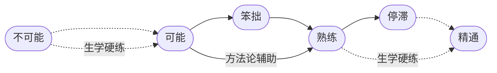

---
outline [2, 3]
---

# 1. 自我训练手册

这一年的集训拉练，核心任务只有两个，**语音塑造**和**记忆扩展**。这一年的另外一个衡量指标是**每天至少三个小时** 并且要做到 **一年内至少投入一千小时的注意力**。

不要误以为最重要的收获只是**把英语变成第一语言**…… 在这个过程中，我们所积累并获得的，除了任务目标的达成之外，更重要的是（可能是很多人一生中第一次）**完整的自学经历**。

不仅如此，还有更重要的东西 —— 这个完整的自学经历，肯定会改变一个人对整个教育的看法，进而影响各种选择，进而改变一个人甚至一家人的命运。

作为作者，我无法把自己只限制在英语教学这个领域。理论上来讲，我们用同样的方式可以学天下所有的东西，只要自己觉得有必要。

某种意义上，这是我一个人与地球上整个教育体系的争斗，为了自家的孩子 —— 换个角度看，这其实是一个唐吉柯德的故事，一个疯子非要打败风车，任人评说。

## 1. 用兵打仗

人们为教育从不吝于支付金钱…… 可惜的是，人们往往不愿意为教育支付注意力 —— 英文的习惯用法很准确，**注意什么东西**是 *pay attention to something*。

我们手里通常有三种资源，**金钱**，**时间**，**注意力**。教育的本质是**投资**自我。天下的投资都一样，投资就需要时间作为基本生产资料，不花时间的或者只花很少时间的不是**投资**，我们对这样的行为有另外一个称呼，叫作**投机**。

投资的时候，我们做的事情，本质上来看都一样，其实是在**往时间里倾注金钱**。如果采用定投策略的话，那就是**不断往时间里倾注金钱但绝不倾注注意力**。当我们学习的时候，或者说，当我们投资自我的时候，有个重点区别，我们要往**时间**里倾注的也有**金钱**，但与此同时，更重要的是**注意力**。

从这个角度望过去，一切学习失败的根源，无非以下两种：

> * 花钱不花时间
> * 花时间不花注意力

到最后，所有的失败都一样，只不过都是因为**没有往时间里倾注足够的注意力**而已。

人们总是误以为决定学习成败的关键在于智商，并且还总是误以为智商这个东西是一成不变的。可实际上，这两个观点都是基于误解的幻觉。

真正的决定性因素在于**注意力**。

 我有一个较为形象的说法。如果一个人可以做到持续 25 分钟左右注意力集中，那么，他就相当于是位**将军**，**有兵可用**。一次持续 25 分钟的注意力集中相当于一个兵。如果一个人在一整天的时间里能做到若干次持续 25 分钟的注意力集中，那就相当于**这位将军有若干个兵可用**。

兵越多当然就越好。只不过一天里的时间是有限的，与此同时，为了注意力集中大脑也的必需消耗大量的能量，所以，兵不可能无限多。然而，对绝大多数普通人来说，只要一天能带上七八个兵，就能做很多事情，若是能够持续下去，就一定能够达成相当惊人的成绩。

**有兵可用**之后要**有仗可打**。养兵靠打仗。没仗可打，兵就会慢慢废掉。只要兵在不断地打仗，它就会变得更为强大，具体表现就是，从**可以持续 25 分钟注意力集中**，发展成**可以持续 30 分钟 40 分钟甚至更长时间注意力集中**。兵当然越强越好。只要是强兵，用很少的兵也可以打很大的仗。

用强**兵**打什么**仗**呢？学习就是用兵打仗，自学就是自己用兵打仗…… 我们这一辈子的绝大部分时间都应该用来**自学**。学什么？学生产知识、学销售知识、学投资知识 —— 用来创造物质财富，然后还要学很多其他知识 —— 用来追求精神财富，然后才能用时间做更多的事情。

遗憾的是，大多数人压根就**无兵可用**，他们根本做不到持续 25 分钟注意力集中。所以他们也不大可能是这个类比中的将军。他们也**无仗可打**，所以他们也根本养不出兵…… 这跟智商或者天分没有任何关系，手里没兵，再聪明都没用。手里有点兵但无仗可打，还是没用，并且因为无仗可打，所以哪怕就那一点兵早晚还是会废掉…… 还是一样的，再聪明也没用。

猜一猜最令人遗憾的事情是什么？

> **每个人原本都有兵，并且还都是强兵。**

小朋友的注意力持续时间都很长，只要不被打扰，他们很容易被某个事物或者活动吸引，然后就会一直专注下去，除非饿了。

父母们往往并不知道要呵护自家孩子的注意力 —— 不管孩子在干嘛，他们都可能随时冲上去抱一下，亲一下，只顾着满足自己。学校也很可能是破坏大多数孩子注意力的帮凶，虽然肯定不是出于故意 —— 长期被迫坐在枯燥的课堂里一口气几十分钟，很多孩子并没有学会注意力集中，真正练出来的是如何坐在那里走神但不被发现。商品经济已经演化成注意力经济，全世界都在争夺我们的注意力。最近十几年兴起的移动智能设备，把地球上绝大多数人的注意广度（Attention Span）生生压缩到了两分钟之内……

就这样，大多数人逐步变成了彻底**无兵可用**、压根**无仗可打**的人 —— 可无比遗憾的是，他们每一个人都一样，在最初的时候，都是天生就带着强兵的强将。

表现出来被别人看得到的聪明，其实都是积累出来的 —— 别说聪明了，连所谓的天分都是如此，如果天分这个东西真的存在的话。

过去，人们认为**标准音高**（Perfect Pitch）是一种天分，有就是有，没有就是没有，人群中恨不得只有十万分之一的人拥有这种天分，比如莫扎特 —— 莫扎特可以分辨任何声音的音高（Pitch），哪怕是你在另外一个房间咳嗽一下，他都可以用键盘弹出你刚刚那声咳嗽的音高。

可后来研究者们发现，人们过往误以为的天分，其实都是**练**出来的，无一例外 —— **练出来**的诀窍竟然只不过是**练的久**…… 对那些被称为天才的人，他们真正的**优势**其实只不过是**练得早**，所以才**相对练得久**…… 越来越多的脑科学家们的研究结果在不断支持这个结论，每个人天生可能都有差不多的**潜力**，只不过这个潜力要**练**才能**实现**…… 换句话讲，很多人不是没有天分，而是因为虚度了时光才吃过了失去了实现天分的机会。

练习标准音高没多难，没多复杂，网上甚至有很多免费的开源程序。今天，人群当中拥有标准音高的比例，早已不再是十万分之一，也不是万分之一、或者千分之一…… 早就超过了百分之一，并且，这个比例还在不断提高。无数实例表明，任何人都可以习得标准音高，只要练习的密度足够大时间足够久，从任何年龄开始都可以 —— 为什么？这不压根是什么**有就有没有就没有**的东西，它只不过是**练就有不练就没有的东西**…… 

人和人之间毕竟有所差异，所以，人们常说的**天分**还有另外一层意思指的是这种**不可避免的天生差异**。比如，手指短的人可能弹琴相对吃亏一点，个子矮的人可能打篮球相对吃亏一点，长得帅的人在人际沟通中相对可能更有优势，有标准音高的人在学外语尤其是练语音的时候肯定相对更有优势…… 这好像是不可否认的事实。但与此同时，我们总是可以看到更多的**反例**，手指短的钢琴大师其实不少，个子矮的篮球明星并不罕见，长得丑但成功率更高的谈判专家非常普遍……

学就是了，练就是了。反正，你应该是一位将军，你原本的确是一位将军，你要带兵打仗。

一场又一场的胜仗打下来，积累的不仅是成绩，还有越来越强越来越多的兵，以及调用指挥这些强兵的经验。如此看来，到最后，一个人能拥有的最强能力，就是**调用并指挥注意力的能力**。一旦真的拥有了这个能力，有兵可调，有仗可打，那就只能所向披靡，无往不利 —— 这跟智商和天分显然全无关系…… 如果真的有关系的话，应该是人们常常把这种能力的展现理解为智商或者天分吧。

还是**换个观念吧！**

> 天分这个东西就算真的存在，和所谓的智商一样，都是**练出来**的，都是**攒出来**的，而不是像某个配件一样可以直接安装或者干脆预装的。

在这方面换个更合理的观念非常划算的，因为那等于轻松且又瞬间地直接换了个脑子 —— 比所谓的脱胎换骨实在多了。

以下分步的陈述可能更准确更有效：

> - 你有无穷的**潜力**；
> - 你的**潜力**能否**实现**，取决于你**练不练**，**练多久**，**练多早**，**练多狠；
> - 你能实现**多少潜力**，取决于你有**多少时间**；
> - **你的时间**是否有效，取决于你向其倾注了**多少注意力**。

学习的理由无数。但从这个角度望过去，倒也非常简单直接清楚：我们必须**拥强兵为强将**，否则多可怕啊！用我们的时间，调兵打仗。无仗可打的话就找仗去打。生命不息，战斗不止，能实现多少潜力就实现多少潜力。

## 2. 只能自学

**学习**这个词，由**学**和**习**两个字构成。前面是**学**，**求学**的**学**；后面是**习**，**练习**的**习**。在中文里它们原本是各自独立的两个词。孔子曰，**学而时习之，不亦乐乎？**后来的中文里，人们干脆把**学习**两个字组合起来构成一个词，意思就是说，**求学**只是一部分，而另外还有一部分是**练习**。

花钱买书，花钱上学，到此为止，只是**知识获取**。家长也好、老师也好、学校也罢，甚至整个社会一直在误解**学习**，家长们不吝于投入大把的金钱把自家孩子送进学校，把整个教育外包给学校里的老师…… 学校里的老师们主要在干嘛？把书本里的知识讲一遍。再负责一点就反复讲，做到**的确将所谓的知识告知了学生”。

然而，这只不过是教育这个万里长征的第一步而已。后面的**练习**呢？为了在自己大脑里新建连接新建网络而必须进行的**短时间内足量重复**呢？学校也好，老师也罢，完全无能为力 —— 并且，理直气壮地认为那是学生自己的事，跟自己没关系…… 这本身倒也没错，的确是学生自己的事。

可问题在于，父母花钱买的商品及服务，就只是或者只能是发教材讲解教材吗？小学三年级之前也许还有必要，等常用字词已经搞定了，自己也会查词典了，电脑上有搜索引擎甚至人工智能，真的有必要非得花那么多钱找人讲给自己听吗？

教育越来越昂贵，可是，过往的两三百年里，全世界都一样，收着最贵且越来越贵的价格，交付的是一直是最不重要的那个服务，发书讲书而已…… 实在觉得对不住，就使劲留作业，这就算对的起那么昂贵的费用了，是不是有点说不过去？

很多家长没有反应过来。人类进入 21 世纪之后，必要的教育所需要的任何知识，早就已经接近于免费了。网络上没有找不到的基础知识及其讲解。[Wikipedia](https://www.wikipedia.org/) 和 [Youtube](https://www.youtube.com/) 已经是天下再好的学校了。再高级一点的知识，再系统一点的讲解，只要识字就可以去买书。到 2020 年，[Amazon](https://www.amazon.com/) 上在售图书已经超过 5 亿册，没有你找不到的东西，平均每本书 25 美元，与那么昂贵的学费相比，这仍然是几近于零的免费！

绝大多数人的问题都一样，都肯花钱，也有一些肯花时间，却全都不肯花注意力 —— 说实话，他们也不知道注意力应该花到哪里，姑且不论有没有足够的注意力。

学习，**学**与**习**，**求学**与**练习**相比，显然**练习**更为重要。**知道**与**做到**之间存在着非常遥远的距离 —— 时间上的距离。

学外语就是很好的例子。我可以清楚详细且又系统地把各个英文音素的发音方式和要点写给你、讲给你，还可以反复讲…… 然后你的确可以表示自己知道了，但你真的能做到吗？马上能做好吗？不是不一定，而是刚开始一定不能。

学了不练就没有用。练习必然耗费大量的时间。

并且，练就只能自己练。学的时候也许大伙一起更有效果，但练的时候大伙一起往往都会被最差的那一个拖后腿。并且，每个人都不一样，每个人的难点不同，每个人之前的积累不同，每个人练习的方式不同…… 所以，绝大多数情况下，有用的**练习只能是个性化的**，越是关键点越是如此。

所以说，**练习不仅只能靠自己，绝大多数情况下还是非常私人的**。我可以告诉你一个秘密：只要肯练，不管有没有天分，任何人都可以学会弹奏乐器，都至少能达到一定的程度。练过琴的人都知道，练琴跟练任何东西一样，只能私下练。刚开始那么笨拙，弹出来那么难听，自己不好意思让别人听到，别人听到了也的确不开心。没有初学者愿意在舞台上当中练习，不是吗？

练习必须私下练还有另外一个理由，与我们的大脑机制有关。学习的时候，大脑最怕的被他人关注，被越多的人关注越可怕。**因为大脑最怕死，尤其怕社死。**一旦意识到自己被关注，大脑就要把注意力分散出去，而后很可能马上就宕机。这叫聚光灯效应（Spotlight effect）。如果你突然意识到所有人都在看着你走路的话，突然之间，你有可能干脆不会走路了……

自己花时间练习也许并不够，因为很多人练习的时候注意力并不集中。一不小心就变成了在走神的状态下肢体在进行下意识的机械重复。

科学家们提出了一个极为重要的概念：**刻意练习**。按照他们一致的说法，刻意练习的关键在于**不断提高练习的难度**，**不断突破舒适区**，否则，更多的练习不仅不会带来进步，还会导致一定的退步。

**练习**当然要**努力**，即，**短时间内足量重复**。那么刻意练习呢？关键在于哪里？我觉得：

> **刻意练习**的关键在于**注意力**：
>
> > 在**练习**的过程中要有组织有计划有系统地调用并集中自己的**注意力**，发现问题，解决问题……

换言之，注意力不集中的练习往往会沦为无效练习，只浪费了时间，却没有任何收获。

刚才我们说，**知道**与**做到**之间存在着非常遥远的距离 —— 时间上的距离。现在，我们还得继续补充。这个时间必须注满了**注意力**才有效，空洞的时间总是无效…… 请问，这个时间里应该是谁的注意力？只能是**自己的注意力**。谁往时间里倾注注意力，那本事就长在谁身上。

练习就是这样，在自己的空间里往自己的时间里倾注自己的注意力，也许偶尔需要他人帮助，但，总体上，练习就是与他人无关，只能是自己认真做的事情。

自学，并不意味着说一定要完全孤立自己，虽然集中的注意力只能出自自己，虽然有效的练习常常只能是私人甚至私密的…… 自学的关键在于**主动**。**主动向他人求教**就很关键。**主动锤炼自己的教师品味**也很重要，比如，你最好在能分辨出谁是真正的好老师的同时，也能分辨出谁是跳大神的二货…… 这就需要自己主动建立一系列的**评判标准**。然而，不自学的人，无论如何都不可能有任何真正恰当且有有效的标准。

人天生是社交动物。大脑内部是无垠的网络，大脑外部也是无垠的网络。人们在相互交流相互观察之中潜移默化地学习。社交过程中形成的各种微调，永远是教科书、老师和学校无法替代也无法达成的东西。想想那个例子：你的口音就是会因为生活地点的变化而不知不觉发声变化，没有什么教科书、老师或者学校可能导致这种不知不觉发生的微调。

所以，**主动寻找更好的环境**也很重要。正如在大家都挥霍的时代里你也会不由自主地更加挥霍一样，若是大家都在玩乐沉沦你会不由自主地浪费更多时间。同样的道理，如果你身处在大家都对学习感兴趣的环境里，那么，你自然而然就会对学习更感兴趣；在大家都努力工作的环境里，你自然会比原来更加努力。万一你身边积极向上的人更多且很多，你也自然会找到更多的理由奋发图强。

**主动帮助他人**最重要。帮助他人可能是天下成本最低却又收益最高的社交手段。关键在于，帮助他人发现问题解决问题，是锻炼自己的机会，因此建设得更好的是自己的大脑皮层。学习的核心之一就是发现问题解决问题，可是，仅靠自己一个人很难有机会遇到所有问题，不是吗？于是，帮助他人虽然可以收获感激，但更重要的另外一个副作用是获得了原本可能并不存在的锻炼自己大脑的机会。

学校原本应该起好作用，但最终总是在大多数人身上普遍留下了这样那样令人无比遗憾的印记。学校里枯燥的课堂、无聊且无尽的作业、没完没了大大小小的考试，虽然都出于好意，最终磨灭的是学生的**主动**。十几年如一日，学生们一直在**被动**地疲于奔命…… 到最后甚至在他们的眼里，父母竟然沦为了学校的帮凶。终于，他们最后唯一的主动诉求只剩下逃离的渴望。斗转星移之间，他们中的绝大多数不知不觉地彻底失去了**主动能力**。

**自学全靠主动**。目标要自己找，动力要自己挖，计划要自己做，困难要自己克服，错误要自己纠正，注意力要自己集中自己的注意力，好坏最终只能靠自己验收，后果只能自己承担…… 若是竟然失去了主动能力，这一切就无从谈起。

社会上绝大多数人根本就没有自学能力。可说实话，这事儿很难全怪他们，他们原本不是那个样子，上学前都好好的，主动的能力非常完整。那责怪学校有没有用呢？首先没用，其次更重要的是看透真相。因为这世界原本就是这个样子，从来都是这个样子，古今中外都一样：**好的意图从来都并一定不保证好的结果**…… 并且，**重要的事情从来都只能靠自己**，越是重要的事情越是如此。

## 3. 生学硬练

无论我们做什么事情，大脑都要协调很多的器官才能够完成，它不仅要协调大脑外的各种器官，它还要协调自身内部的多个部位。无论是大脑外部的种种器官还是内部的各个部位，对大脑来说，都是大脑自身内部无数个**局域网**的联动……

这些局域网都是逐步建立起来的 —— 每一个都是通过学习建立，通过大量重复使用强化。无论我们想要学什么，第一步总是注意力集中地观察 —— 调用任何必要的感官，视觉、听觉或触觉等等  —— 然后我们才开始尝试……

几乎总是一模一样的流程：一旦开始**尝试**，首先遇到的肯定是**不可能**，要经过**反复尝试**之后才会遇到**可能**，可能之后马上遇到的是**笨拙**，再过一段时间才可能是**熟练**，而后可能是漫长的**停滞**，要经过很多刻意练习之后才可能**精通**……

这之中最重要且又最难的，当然是从**不可能**到**可能**的跨越，那可是 0 到 1 的突破。

核心的难度首先在于，**我们的观察永远不大可能完整**。举个例子，我的母语之一是朝鲜语，所以我能发出齿龈颤音（[Voiced alveolar trill](https://en.wikipedia.org/wiki/Voiced_dental,_alveolar_and_postalveolar_trills)）。我家有个小朋友小名叫都都（dū dū），平日里我逗他玩的上班，会故意用齿龈颤音喊他名字：

<audio controls><source src="/audios/dudu.mp3">Your browser does not support the audio element.</source></audio>

他们觉得很有趣，也想发出同样的声音。可在接下来的很长一段时间里，他们就是发不出这个音。他们会反复尝试，但就是做不到。他们发出的可能是用嘴唇发出来的颤音 —— 只不过，在那一瞬间他们自己也知道那不是他们听到的那种颤音。他们会继续想办法，换各种各样的方式尝试，但依然不行……

主要原因在于，他们看不到我的舌尖是如何在齿龈部位颤动的 —— 这就是观察无法完整造成的难度。另外，我还真讲不清楚我到底是怎么做到的，我会误以为我从小就会…… 实际上并非如此，当初的我和我现在的孩子一样，刚开始怎么也发不出这个声音，很久之后才能发出那种声音，但，我早就忘了自己其实是通过无数次尝试才习得的，竟然误以为那是一种天生的能力。

幸亏，在 Wikipedia 上，有这种齿龈颤音的完整且又系统的讲解 —— 有 37 种语言的翻译，其中，英文版是 [Voiced alveolar trill](https://en.wikipedia.org/wiki/Voiced_dental,_alveolar_and_postalveolar_trills)，中文版是[齿龈颤音](https://zh.wikipedia.org/?curid=274842)…… 不仅有详尽的文字讲解，还有慢动作视频演示：

<video controls width="480"> <source src="/videos/voiced-alveolar-trill.mp4" type="video/mp4"></source>Your browser does not support the video tag. </video>

现在，不仅观察完整，方法论也很系统…… 可是，看过之后就能做到吗？显然还是不可能。大脑内暂时还没有对应的可供调用的基础功能性局域网，需要新建。并且需要的还不止一两个，别看只是这么小小的一个动作，实际上却需要远比想象多得多的基础功能性局域网相互协调。新建连接新建网络就是需要时间，无论观察完不完整、方法论存不存在，时间总是不可跨越。

那如何才能**突破**呢？

在我长大的年代里，香港连续剧在中国大火，又由于那个时候可看的东西少，往往是一部剧全国都在追…… 在某部武侠剧里，一个**武林高手**在镜头面前有个特写，观众们看到的是，他的耳朵竟然会动！第二天，全班同学都互相问，你的耳朵能动吗？大家都不行…… 在此之前，每个人的耳朵都没动过，也没想到过要动。过了几天，有个同学说他**会动耳朵**了！大家惊讶地看他表演…… 再过几天，班上很多同学都**学**会了怎么**动**耳朵…… 当然，谁都说不明白**如何动耳朵**的**方法论**，都是一样的措辞，“多试试就可以了”。

就是这样 —— **多试试就可以了**。

在新疆，所有人在很小的时候就**学**会了**晃脖子**，那是一种其他民族的人少有能做出的动作。你去问他们，到底应该怎么晃脖子，他们真说不清楚，就算偶尔有人说得很清楚，你也学不会…… 真的**学不会**吗？肯定能学会，至于**方法论**么，不是没必要，而是它能起的作用并没有想象得那么大。

很少有人能**动鼻尖**，生活中，也没有什么这样的**需求”…… 但，两个版本的《家有仙妻》的主演，无论是电视剧版里的伊丽莎白·蒙哥马利还是电影里的妮可·基德曼都学会了这个动作 —— 怎么学会的？跟**动耳朵”、“晃脖子”一样，“多试试**就可以了。

突破的关键在于**不停地尝试**，一个方式不行就再换另外一个方式。反正新建连接新建网络就是需要时间，用什么填满那些时间呢？试错 —— 这可是大自然用来进化的唯一有效策略。进而，为什么可以不断尝试？又，为什么愿意不断失败不断尝试？因为它**肯定可能** —— 别人能做到，我也能做到…… 

这才是人生最凶悍的学习方式，我称其为**生学硬练** —— 不断试错直至可能，不断重复直至熟练：

> 因为肯定可能，所以才愿意不断尝试；失败很正常，换个方式接着尝试，直到可能。

一切的学习，对大脑来说都一样，最初 0 到 1 的突破，根本就没办法靠方法论解决，都只能靠生学硬练闯过去…… 等这一关过了，在把不可能变为可能之后，从笨拙走向熟练的过程中，方法论才开始有机会发挥作用。

可问题在于，方法论这个东西，即便有用，也常常并不能独立起作用。举个例子，我告诉你 `ŋ` 这个音后面跟着元音的时候会变成 `n`（[2.2.3.](../sounds-of-english/15-mn)）—— 你当然瞬间能够理解，甚至能够记住，可是，下一次你开口说的时候，就能做到吗？十有八九做不到。这种例子比比皆是，绝大多数英语语法知识点对第二语言习得者来说都是这样的，考场上基本上都能把题做对，可是一开口说，一动手写，就接二连三出错，即便在出错过后瞬间还能够自我意识到…… 

很多重要的知识和技能就是这样，知道根本没有用，哪怕熟练也不够用，必须精通才真正有用 —— 因为必须做到能够下意识无意识都能做对的地步。大里必须为了这个所谓**知道**要建立新的连接和网络，并且还要不断强化，强化到一定地步才能够下意识甚至无意识地正确处理这种情况 —— 熟练只是卸载了部分负担，这需要极大量的重复，最好还是短期内足量重复；必须精通才能彻底卸载负担，这还需要极大量的重复，最好还是短期内足量重复…… 只有精通，大脑才能彻底无负担地同时做其他的事情……  说来说去，这不全都只能靠生学硬练嘛？

所以，生学硬练实际上贯穿着整个学习过程 —— 从始至终，任何时候都可能需要生学硬练，关键的时候尤其如此。之前的说法也应该调整一下了，所谓的生学硬练，应该是**不断试错直至可能，不断重复直至精通** —— 而不只是熟练而已。

**生学硬练，原本是我们与生俱来的能力。**毫无疑问，在最初的几年里，无论什么都是我们通过生学硬练掌握的。理论上来讲，自然语言处理，是人类的大脑终生能够处理的最高级最复杂的任务（没有之一）；与之相应的，自然语言习得，显然是我们这一生能够遇到的最复杂最艰难但又必须完成的学习任务。但是，自然语言习得的最基础部分，**语音塑造**和**记忆扩展**，却能在还没上学还不识字的过程中就逐步完成 —— 全靠生学硬练。

即便是到了很多所谓高级的领域，也还是一样的。有人能手把手教，当然很好。但总有一些是身边没有人会的，那怎么办？看书，然后自己学、自己练。有没有可能连书都找不到呢？当然。没有人可以在身边手把手教，书里也找不到，那怎么办？到最后永远都能仰仗的，再一次只能是生学硬练……  

随着时间的推移，绝大多数人竟然彻底忘记了自己曾经拥有过的生学硬练的本领。这背后的根源虽然有点微妙但也格外简单。

每个人的时间都有限，刚开始的时候并不觉得，所以很难在意**效率**。随着岁数的增加，过去的占比越来越高，未来的占比越来越少，效率的重要性就显得越来越大，于是，越来越渴求一切可能会提高效率的方法论…… 越来越痴迷于方法论，甚至不惜欺骗自己去相信那些只是胡搞瞎搞但就是敢坚称自己有效的所谓方法论。甚至，开始莫名其妙地鄙视生学硬练。与此同时，一切需要生学硬练的，都直接跳过，借口说那需要一些自己没有的天赋，所以自己永远学不会 —— 倒是可以因此轻松原谅自己，以效率为名。

绝大多数人的问题只不过是，对自己要求太低，对世界要求太高。特别擅长糊弄自己，然后也习惯了糊弄世界…… 这个世界说实话倒也听宽容，一般不会马上反击，可它总有忍不住的时候，万一它反手一个耳光扇过来，没有人能承受得住。

生学硬练也有技巧：**变着花样不断搞**。**试错**，总是需要不断地换新方式去尝试，然而，**重复**，也需要不断地换着方式重复，从各个角度、从各个层面去重复，变着花样去重复。只要你肯不断变花样，原本看起来无比枯燥的生学硬练就会变得趣味丛生，其乐无穷。

## 4. 走出迷宫

这世界绝大多数真正有用的知识本质上都是网络结构，每个知识要点就是大大小小的网络中的一个又一个的节点。网络中的节点越多网络结构就越复杂，当然很可能也因此网络更有价值。

::: info

[**梅特卡夫定律**](https://zh.wikipedia.org/?curid=1777483)：网络的价值与网络中的节点数量的平方成正比。

:::

当人类需要记录甚至传播知识的时候，总是面临一个不可回避的问题：

> 知识是网络的，语法是树状的，文字是线性的。

斯蒂芬·阿瑟·平克（Steven Arthur Pinker）说，“写作之难，在于将网状的思想，通过树状的语法，用线性的文字展开……**

这有点像什么呢？这就好像是在二维的平面上绘制三维的物体…… 一不小心就可能看起来像是那种[不可能图形](https://en.wikipedia.org/wiki/Impossible_object)…… 

> 这是我多年前设计的一个 Logo。由于故意未使用虚线表示透视效果，你可能会看到两个方向的拱门，一会儿看起来像是朝向左下角，过一会看起来又像是朝向右上角……

当我们在二维的纸面上勾画三维世界的时候，如果不借助一下其它手段的话 —— 比如用虚线、阴影、以及形状的变化去构建透视效果 —— 就很容易令人产生这种错觉。

所以，虽然写作的难度很高，但，相比来看，弄不好阅读理解的难度更高。网络就好像是一个迷宫，节点越多，迷宫越复杂。而书籍就好像是读者手里用来探索迷宫的地图…… 可万一如何读者看到的是个**不可能路径**，又如何是好？有的时候，也许只是作者不小心，忘记了借用一些手段避免这种情况。可另外还有一些时候，这种情况无论如何都不可避免 —— 说实话这种情况还挺常见。

越复杂越系统的知识书籍里总是充斥着越多**前置引用** —— 即，提前使用目前尚未定义清楚需要在后面深入阐释的概念；比如，在第三章里出现的概念，实际上需要在第十二章进一步讲解才能真正深入理解。越是高级越是实用的知识与技能越是如此。

几乎所有的语法书里都有大量的前置引用存在 —— 只因为自然语言的天然复杂程度。计算机书籍里这种情况也很普遍 —— 人工语言的复杂程度并没有相对自然语言更低。即便是我们那仅有 2 万字左右的简明语音教程，也有大量的前置引用 —— 别看英语音素 50 个都不到，不仅细节很多，相互影响还不少……

网络的特征之一就是节点之间的通路不止一条。可问题在于，我们的限制不仅来自于我们只能线性地理解用树状的语法所描述的网络，更大的限制来自于我们的**注意力**也好**时间**也罢，都不仅都是**线性**并且还同时具备**排他性**，导致我们永远一次只能尝试一条通路。也就是说，我们只能投入多倍的时间精力在遍历所有路径之后才能确认最佳路径 —— 在遇到**不可能路径**的时候，尤为如此。

自学的最基础且最重要的习惯之一就是：

> **反复阅读教材……**

这就好像好电影值得反复看一样 —— 很多细节在第一遍看的时候要么被忽视，要么被轻视，只有理解了后面的很多内容才会意识到前面有很多重要的线索。重要的教材也是如此，必须反复阅读。

很多人不明白这个道理，不知道如何应付这种情况，造成的结果是一遍都读不完 —— 殊不知，所谓的难度是因为没读完造成的…… 实际上，如果能把后面的都硬着头皮读完，前面的就好理解了。也就是说，往往并**不是因为难才读不完**，更多是因为**没读完才很难**。

另外，很多早期所谓的难点，随着第一遍的完成，以及随后重复次数的增加，会自动消失 —— 甚至不需要为它们专门挣扎。因为绝大多数难点本质上来看都是因为前置引用的现象。

学习计算机编程就是经典案例。编程语言是一种人工语言，词汇量极少 —— 比如，Python 总计就那么几十个关键字（keywords）和操作符（Operators）…… 说实话真的没多难，从结果就看得出来 —— 很多中小学生都能熟练掌握。可它就是难倒了绝大多数人，其中包括很多高学历的人。为什么？怎样才能学会？答案其实很简单，随便哪本教材，反复看很多遍就自然会了 —— 一遍都看不完当然不行。

> **教材么，看不懂也要读完，然后还要认真读很多遍……**

 —— 这就是学习一切复杂且又系统的知识的秘诀，虽然简单得要死，却也是绝大多数人终生并未知晓，不知道为什么就算知道了也永远不会实践的公开秘密。这也不是什么今天才有的神技，古人早就慨叹过：读书千遍其义自现…… 只不过，这话谁都听过，但也谁都并不当真而已。

只要要点足够多且足够杂，就一定会逼退绝大多数人…… 可是，解决它的方法还是一样的，只不过是耐心重复而已。不需要一下子生生地讲全部记住，不是你做不到，谁都做不到。但不是做不到，只要肯重复，谁都做得到 —— 通过反复查询反复应用逐步形成系统的记忆。

一个经典的例子是地图。搬到一个陌生的城市，没有人会尝试一下子记住地图上的所有细节…… 都是需要去哪儿就去查一下，然后尝试记住那一个路径；日积月累，自己需要去的地方就都记住了，还有些没去过的地方，不知道也无所谓。我们对待词典和语法书的方式也是一样的，先去熟悉查询方式，而后需要什么就去查什么，日积月累，该知道的就都知道，该记住的就都记住了。

学习任何系统且又复杂的知识，都可以把它想象为一个游戏，探索迷宫游戏。这很可能是世间最有趣的游戏之一，弄不好也是我们可以用来锻炼脑力的最佳实践活动。不要误以为自己暂时被卡住了或者暂时被难倒了是坏事，恰恰相反，那只能是好事。因为我们所有的本事，都是被困难逼出来的 —— 没有困难，我们就不用挣扎，不用挣扎就没有机会长出新本事。

为了在自己的大脑里构建一个能够摆脱线性文字束缚的立体地图，我们需要借助很多手段，就好像在二维纸面上要用虚线或者阴影那样。我们需要自己反复归纳整理那些繁杂且有相互关联的概念，可能要按照自己更容易理解的方式重新描述、重新分类，甚至还可能需要从多个角度反复如此操作，甚至，有必要的话，干脆自己尝试着写出更好的教材……

掌握任何一项新技能，都是探索迷宫走出迷宫的游戏。在这个过程中，掌握的不仅仅是那系统且又复杂的知识，与此同时，探索迷宫的能力也在不断积累不断发展 —— 以后可以更轻松地探索其它的迷宫，甚至，只有这样才可能有资格去探索更庞大更复杂的 迷宫。

在学校里，这些工作被认为是老师的责任…… 探索迷宫的，只有老师 —— 他们的自然定位就是向导。学生们呢？就好像天然是旅行团里的游客，之所以付钱就是为了购买向导的服务 —— 倒也省心，只要听从向导的安排就好了……

这也有点像过去有些家长喜欢帮孩子把食物嚼碎了再喂一样。一方面孩子失去了锻炼咀嚼的机会，另外一方面还有可能把病菌传染给孩子 —— 更气人的是什么呢？事实上，那么做的结果是，食物的营养大半都被大人在咀嚼的过程中自己吸收了，而喂到小孩子嘴里的，其实过半都是没啥营养的渣子而已。于是，老师们越教越会，学生们倒是越学越差 —— 这其实是差不多从一开始就注定的结果。

这当然需要耐心 —— 耐心是一种习惯，需要不断积累且不断呵护的习惯。比耐心更重要的更基础的是另外一个习惯：主动。主动的背后，主要由两层结构：

> * 的确有问题需要解决
> * 认定自己有能力通过学习掌握解决问题的方法

谁没有问题要解决呢？都有。所以，第一层比较好办，大多数人毁在第二层上。多年所谓教育的荼毒，以及多少因此而累积的挫败，逐步使绝大多数人误以为自己根本没有有能力通过学习掌握解决问题的方法。在此之上叠加的是时间流逝带来的紧迫感，他们更需要的是不择手段地马上解决问题 —— 当然那肯定只能是痴心妄想 ——而不是那种需要投入金钱、时间以及注意力才能够获得的解决方案。

## 5. 自我纠正

**自学**的核心之一是**自我纠正能力**。

做得好的人都一模一样，做得差的人千奇百怪 —— 因为每个人的错误都非常个性化。自我纠错难就难在这里，个性化错误的主要特征就是细小且又繁杂，并且常常连自己都觉得出其不意乘其不备。

自我纠错就好像给自己剃光头一样，看起来不是什么难事，结果总是莫名其妙地残留着几根要过段时间才能被发现…… 不要误以为别人帮你剃光头就完美了，没用的，你自己去过几次理发店就知道了，到最后总是可能会有幸存的那么几根。

全面纠错只能靠自己，别无他选。反过来也一样。但凡一个人拥有足够强的**自我纠正能力**，那么他就是自己最好的老师、教练、同学、朋友。可问题在于，**自我纠正能力**如何培养，它又从何而来呢？

先说一个与我们自身大脑有关的现象：

> * 你注意不到的事情，对你来说就不存在；
> * 你并不知道的事情，你就无法注意得到……

很多人不是不花时间，也不是不努力，但，最终沦为无用功，问题出在哪里？

关键在于后一点。很多人的所谓练习之所以最终无效无用，是因为练习的过程中没有把注意力集中在要点上。在整个练习的过程中，因为不知道自己需要注意的要点都是什么，所以，无法注意到在那些要点上出现的错误和偏差 —— **不知道就注意不到**。

知道不一定能做到也不一定能做好，但不知道肯定做不到做不好。

每个人都一样，记忆力没有自己想象得那么好。不是什么东西看一遍就记得住的。基础知识也好方法论也罢，都写在教材里 —— 知识获取本身现在既方便又便宜。可问题在于，谁都一样，都做不到只看一遍就能全都记住，不是吗？

全都记住了还不一定能做好呢…… 但，这恰恰是很多人没反应过来的关键：

> 就算暂时做不到，就算暂时做不好，**要点一定要尽早烂熟于心**。

不只是一般的记住，而是烂熟于心，翻过来掉过去，每个细节都能随时调用，每个细节之间的关联都清楚，每个细节都能说清楚讲明白，而不仅仅是能想起来…… 就好像那些经验丰富的老师一样 —— 对，自学就是自己教自己，在自己这个学生还做不好甚至做不到的时候，自己这个老师要先认真备课，否则自己拿什么教自己啊？不提前认真备课，自己拿什么监督自己调整自己呢？

烂熟于心的方法再朴素不过了，**反复阅读教材** —— 我们也是用同样的方法探索迷宫走出迷宫的……

我们想要塑造我们的语音，也只能是同样的方式。你要花一整年时间才能搞定呢，但，在第一个月里，语音教材要只字不差地阅读，并且还要反复阅读。你会越读越快的，不出一周的时间，你会发现完整过一遍只需要一点点的时间，一天能过很多遍。继续。不仅每天过很多遍，还要尝试着自己给自己讲课，看看能不能系统完整地讲清楚 —— 验收系统性和完整性。也可以尝试给别人讲，比如，给自家的孩子讲；还可以尝试带着他们做一样的事情，让他们给你讲，你来提问，你来验收系统性和完整性。

把所有要点烂熟于心，并不能保证你自动做到或者自动做好，因为你的大脑只是牢牢记住了那些要点，至于做到或者做好，那就要通过短时间内足量重复的练习在自己的大脑内部新建连接新建网络、强化连接强化网络…… 必要时还要借助生学硬练呢。

不一样的地方在于，**一旦你知道了你就注意得到**。对于那些要点你越是烂熟于心，你越是能够轻松地注意到在关键点上你做不到的地方，你做不好的地方 —— 这时候，那些方法论才开始真正发挥作用，你可以调用你的注意力系统且又完整地进行突破，要么暴力破解要么逐步微调。

可是，如果你不知道的话，你的注意力就压根没有目标可以集中，它就会跑到鬼知道的什么地方，进而你的所有练习都可能毫无作用，因为你的时间里并没有被你的注意力填满 —— **只有用注意力填满的时间才具有真正的价值**。

绝大多数人对自我纠正能力培养的过程充满了误解。

实际情况是，绝大多数人从未自己把教材阅读很多遍，他们顶多听老师讲一遍，可说实话，大多并没有听全。或者，另外一些的确认真听讲了，却又到此为止了，觉得自己已经足够尽力…… 说实话，他们的自我感觉也的确有点根据，毕竟他们已经比绝大多数人强多了。极少数人可能读了很多遍，甚至自己也做了很多归纳总结，但，不知道从知道到做到依然还需要很多**生学硬练**，所以也没有走到尽头，虽然已经成绩不错。

最大的误解在于，如果不认真提醒的话，绝大多数人会误以为自己**做不到**将教材烂熟于心。其实，人类的记忆力都是很强的，并且都一样，都是越练越强。别说一本教材了，只要肯弄，多少本教材都一样可以做到烂熟于心，花时间而已的事情，和智商全无关联。可反过来，一旦认定自己做不到，那就真的做不到了。

除了误以为自己做不到之外，还有另外一种常见的误解，觉得**没必要**。如果仅仅是为了考试，甚至只不过是及格万岁，那连我都会同意，不仅的确没有任何必要，甚至干脆就不应该浪费那个时间。但是，如果是为了健脑，为了锻炼自己的大脑，锻炼自己的注意力，想要拥强兵为强将，那怎么可能没必要呢？这哪儿是必不必要的事情，这干脆是**不得已**的事情啊，大家的脑子都一样，都是这样，用进废退。

学校的负作用之一就是阻断学生的自我纠正能力。在学校里，验证自我能力的方式只有粗暴且又粗糙的考试。并且，学校里的考试实际上并不要求也不敢要求所有学生都尽善尽美，反过来造成的是学生糊弄过关的习惯。不同的考试成绩，在学生心理上引发的，更多并不是自我检讨自我纠正，而是相互攀比。甚至会不知不觉产生扭曲，成绩比不过就比别的什么，无论是什么，只要能找到自以为是的优势就可以…… 固守型人格在不断发展，彻底消灭进取型人格。

说一千道一万都没用，自己经历过一遍就知道了。对这其中种种好处的体验，就好像是司马光说的那样，**由俭入奢易由奢入俭难** —— 你都住过五星酒店了，再让你回去住街边小旅馆，着实困难。如果你是父母，体验过一次之后，你就舍不得自家的孩子竟然没有体验过。

再回头望过去，你会慨叹，这么简单的道理自己怎么没早一点知道。如果你小时候就被如此告知，甚至被人拉去体验过一回，你还有什么学不会学不好的呢？学校里的那点东西，直到本科毕业之前，也都没什么实际的难度。若是早就知道这样简单却又重要的方式，人生一定会有很大的不同吧？

如果你的孩子很小就懂得用这样的方式培养**自我纠正能力**，他们的自学能力一定相当出众，并且还会不断发展。用得着花那么多钱去请辅导老师吗？完全没必要。这种体验只要带着自家孩子经历过一次，就价值千万 —— 按照 2020 年的人均收入当作现值计算，一个人一生的价值在下一代寿命不断增加的基础上，怎么也得超过一千万人民币。学得好做得好，一千万美金也不一定挡得住。当然，做不到这一点的，就算往教育里砸进去再多的金钱再多的时间，弄不好也会变成一千万里印度拉或者俄罗斯卢布。

## 6. 自主驱动

一百多年前，英国有个生理学家，名字叫做阿奇博尔德·希尔（Archibald Hill），1886 年出生，1922 年获得诺贝尔医学奖。把自己的大部分职业生涯时间都投入到了一个他个人感兴趣的问题上：

> 人究竟能跑多快、多久、多远？

因为他自己就是个热爱跑步的人。希尔起初的认知也很直观：

> 最好的跑步成绩，源自于运动员的肌肉机能，而其中，绝大部分是心脏机能。

换言之，心肌功能越强大，跑步能力越强…… 所以，想要把自己的跑步成绩逼到理论极限，那就等同于把自己的心脏机能逼到极限。换言之，如果我的心脏能比你的心脏向跑步肌肉输送更为充足的血液，我就能跑得比你更快。谁的心脏机能最强，谁的跑步成绩就最高。希尔的几乎所有实验数据都支持这个结论。

很多年之后，有人读到了希尔的论文之后，想到个好主意 —— 这个看似简单直观的**理论**是可以赚钱的！赛马！只要掌握了每一个参赛马匹的心脏机能数据，就可以**合理**预测每一匹马的比赛成绩，不是吗？说干就干！

结果呢？赔的一塌糊涂。在赛马场上，跑得最快的马，从来都不一定是心脏机能最强的那匹马，无论尝试多少次，相对于心脏机能这项指标来看，能跑第一更像是随机的，反正不是心脏机能决定的。

又过了很多年，有人不服气，决定用马拉松比赛的数据核实希尔的理论 —— 很多人不知道的是，马拉松比赛也有人下注的…… 事实上，对赌徒来说，天下的一切事情都可能成为赌博标的。

结果呢？还是一样，希尔的理论得不到真实数据的支持。忍不住用这个理论作为依据下注的人同样赔得一塌糊涂。

又过了很多年，希尔终于弄清了事情的原委，也因此彻底改变了科学家们对运动表现 —— 甚至任何工作表现 —— 的看法。

> 运动成绩不仅仅是你的体能的表现 —— 准确地讲，是你的大脑在那一特定的时刻面对特定的风险与回报是否肯于接纳的表现。

许多年后，脑科学家们对此的解释更为清楚：

> 大脑的首要任务是确保你的生存，即，回避死亡。

如果你的身体不顾一切地开足马力，那么你很快就会筋疲力尽，不堪一击。所以，你的大脑会设定一个效能上的**效能阈值**，比如，75% 就是你的大脑允许你的身体能够发挥的最大效率，太高了有危险，不划算，相对于风险来说，回报不够高 —— 当然，太低了也不划算。这就好像你开的汽车里有个**调速器**，也是这样的，它不会允许你的汽车速度达到**峰值**，否则你的发动机很快就会报废……

但，在赛场上，有很多其它因素存在，比如，马会被骑手**吓着**，然后，它的大脑对风险回报的看法会发生变化，有可能把阈值从 75% 提高到 90%，甚至 100%…… 于是，它的速度就不一样了。更直接的效果是，也许其他的马心脏机能相对更强，但，当某一匹马虽然心脏机能不一定最强，可当它的**效能阈值**被抬高到一定程度的时候，其它的马就比不上它了。

在马拉松比赛里也是如此。比如，有的人是为了自己比赛，有的人是为了家庭，有的人是为了国家比赛，所以对**回报**的看法不同；再比如，比赛的奖金对每个选手的**诱惑程度**是不一样的，所以，每个人的大脑对**回报**的看法不同…… 与此同时，每个人的大脑对**风险**的看法与感受也不相同…… 到最后，真正决定成绩的，在心脏机能基础之上，是那属于每个人都不一样的**效能阈值”。

更为惊人的是，有些时候，那个**效能阈值**有可能超出**100%**…… 看似不可能。你肯定听说过那个惊人的故事，在战争中，一位母亲为了救出自己的孩子，徒手掀起一辆翻倒的吉普车，还能腾出一只手把压在车下的孩子一点一点拉出来…… 这就好像电脑的 CPU 其实可以短时间**超频**工作一样，人们在特殊的情况下，在回报与风险比例惊人的情况下，会爆发出难以想象的**潜能”。

某种意义上，阿奇博尔德·希尔的研究，开启了一个新的领域，叫做**专业**（Expertise）—— 一代又一代的科学家在研究为什么有些人比另外一些人更专业、甚至最专业，他们究竟是如何做到的，以及人们如何才能达到那样的顶峰…… 到了 2018 年，牛津出版了一本书，叫做《牛津专业手册》（The Oxford Handbook of Expertise），专门介绍科学家们在这个领域里的研究成果 —— 其实是一本读起来比较艰涩的**论文集”。

这本书里最惊人的结论之一就是：

> 到最后，无论在哪个领域 —— 你能想到的所有领域，包括但不限于，跑步、足球、篮球、骑马、下棋、弹奏、唱歌、跳舞、手术、手艺、生产、组织、管理、多语、科学、技术、创作，等等等等 —— 都一样，达到超群水准甚至巅峰水准的核心关键，并不在于**天分”（Talents），也不在于**技巧”（Techniques），而是在于**动力**（Motivations）—— 并且总是如此 —— 就是那个**大脑对风险回报比评估之后决定是否接纳的程度**，因为你的大脑会根据它决定你的身体效能的**效能阈值**，这才是影响你最终表现的最关键因素。

按照排序来看，惊人或者过人的成绩，主要根源，按照重要性排列的话，在于：

> * 动机
> * 专注
> * 策略
> * 其它

最重要的因素，其实是**强大的动机**，或者说**强大的欲望**—— 想要做好、想要超群、想要成功、甚至想要杰出的欲望。这是大脑的工作机制决定的，因为出于自我保护的机制和需求，大脑会根据风险和回报确定一个可接受的**效能阈值**，让你的身体及其机能在一定的范围内工作。也就是说，在不知不觉之间，你的大脑为你设定的**效能阈值**，不管合理与否，在暗中决定了你任何工作的最终**表现**或者**成绩”。

再进一步，你的大脑为你设定的**效能阈值**，其实是你的**认知**—— 你的所有知识、经验、见识，以及整个社会对你的影响构成的总和 —— 所决定的。可问题在于，你的**认知**正确吗？充分吗？深入吗？…… 一连串的疑问。

其实，我们甚至没必要争论**自己的认知是否正确”…… 因为，从历史上来看，别说你我了，整个人类的**认知**就没有**正确**过，人类的**认知**一直是在**发展**的，不断改良、不断进步的，没有什么**正确**，顶多只有**越来越接近正确**，没有什么**充分**，只有**越来越充分**，没有什么**深入**，只有**越来越深入”…… 

换言之，我们每个人的**认知**，在每时每刻都有可能**瞬间**就变成**落后的认知**，在必要的时候，必须**改良**—— 在**认知**这个至关重要的方面态度固执，拒绝改良拒绝进步的人，历史上也好，现实中也罢，比比皆是，无所不在，永远占绝大多数。至于为什么，对他们来说，就好像是张洪量的歌词那样，“没有理由没有原因**，只不过是前一句歌词要反过来，“莫名我就讨厌你**—— 绝大多数人讨厌改变。

其实呢，绝大多数人讨厌改变，也同样是受自我大脑影响的 —— 还是出于同样的根源，大脑的自我保护机制。大脑的首要任务是保证自我生存，所以，在能够**生存**的状态下，一切最好都保持不变…… 问题在于说，这种**认知**在原始时代再正确不过了，“生存**本身已经是天大的难题，在那样的环境里，一切的**追求**只不过是充足的食物而已……

唐代的诗人杜甫，自家房子被毁之后，放声大哭，“安得广厦千万间，大庇天下寒士俱欢颜，风雨不动安如山……**说实话，“居者有其屋**，其实一直以来都是很奢侈的。哪怕是**人人都可以吃饱**也只不过是发达国家最近一小段时间才勉强做到的事情 —— 解放后，中国曾经经历过所谓的**三年困难时期**（1959-1961），那期间有几千万人非正常死亡…… 这只不过是 60 年前的事情而已。当然，即便是今天，世界上还有很多落后地区，依然没有消灭**贫穷**和**饥饿”。

仅仅短短几十年不过百年而已的温饱，很难一下子改变人类几十万年来通过基因积累的**习惯**，从人类进化历史的角度去看，大多数人的大脑在**温饱**不是问题，也就是说，**生存不是问题的情况下**，**追求**的欲望并不是很高，甚至，从底层感受上来看，**更多更高的追求**好像没有必要，相对于过去，人们对某个目标或者方向产生**极高追求**的难度，实在是相对太高了，一方面总是感觉没必要，另外一方面更是感觉完全不可及甚至干脆不可望 ——**盼望的望**，**不可望**，就是**压根看不到**—— 人们常说，什么东西**可望不可及**，而我们刚刚说的**极高追求**，望都望不到。

对**大脑自我保护机制**的深入了解，有助于极大提高任何**学习成绩**。这就是**认知改变**带来的**生活改变**。

我们刚刚经历的，就是**认知改变**、**认知改良**、**认知进步**…… 在此之前，我们不知道决定自己专业程度、工作学习成绩的最大最重要的因素竟然并不是我们之前强调过的**专注**—— 尽管**专注**在当时看起来无比的重要；也不是一直以来被所有人都认为最重要的**策略**，竟然是**动机**，那个被**大脑自我保护机制**所设定的**效能阈值**…… 

我们还发现，**满足于温饱**，竟然是绝大多数人**习惯性拒绝改变**的根源，又，竟然还是出自同样的根源，那个无比重要的**大脑自我保护机制**，既然温饱不是问题了，生存不是问题了，绝大多数人的**效能阈值**被设定为极低的一个刻度上…… 从这个角度望过去，所谓**懒惰**或者**好吃懒做**的**人性**，其实是有所来历有所解释的。

 —— 可问题在于，今天，我们事实上生活在一个相对于短短几十年前**充满了无限可能性的时代**，若是我们的大脑把自己的**效能阈值**设置得那么低，实在是太不划算了吧？

懂得这个道理之后，才会明白这才是最本质的**自我驱动**：

> 不断上调大脑为自己设定的**效能阈值**。

这是花钱买不来的东西。

这也是学校和学校里的老师们无能为力的领域，别说他们了，因为这是必须自己对自己做的事情，连父母亲人都无能为力。

如果你是家长，虽然你必须教会自家孩子的事情可能很多，但，**学会调整大脑为自己设定的效能阈值**，在那长长的列表上，理论上应该排名第一。

## 7. 自我鼓励

自我驱动很好。一旦启动，我们就好像正在行驶的汽车一样。遇到颠簸、遇到弯道，它可能需要放慢速度，遇到陡坡的时候它可能需要加大马力，甚至，它也有可能半路抛锚，需要重新启动…… 而这一切，总是需要我们自己完成，虽然借助外力并不是不可以，但，靠自己总是更有效率。

首先，我们需要不断强化我们的动机，让我们自己遇到**意外熄火**的时候更容易**重新启动**。

**正面做法**是主动为我们的目标、行动及其成果从各个层面赋予更多更大的**意义**。**负面做法**是调用我们的**恐惧** —— 对我们的大脑来说**恐惧永远是最佳驱动力** —— 它会在潜意识层面不为人知地发挥巨大作用。

我们可以算一个**假账**。

《财富的真相》里我讲：

> 我们这一生的所有财富，不管是物质上的还是精神上的，都是从自己的**时间**里挖出来的……

既然，**时间就是生产资料**，那么，用它干什么最划算？

到最后，选来选去，只有**自学**。虽然**练英语**，好像与**生产**、**销售**、**投资**并未直接关联，**学它干嘛？** —— 我们先不说**赚钱**，先说说**省钱**。

从比例上来讲，父母把绝大多数钱都花在孩子身上，尤其是**学习**上，这种现象在全世界都很普遍…… 所谓的**绝大多数钱**，从比例上来看，超过父母总体收入的 *60%* 并不罕见，高达 *80%* 也不稀奇。

当我们说**一年内至少一千小时的注意力投入**去**练英语**的时候，核心不只是**英语**本身 —— 因为，实际上你用同样的方式练任何语言，或者练任何其它技能都一样的 —— 在这过程中，学得更多、练得更多，体会得更深的，其实是**自学**，是**自学能力**的养成与发展。

如果你作为父母，竟然真正拥有自学能力，你的孩子哪怕仅仅通过耳闻目染也会拥有相对更强的自学能力，更何况，这个训练本身，从一开始就可以全家人一起做。只要孩子有一定的自学能力，那么，父母在孩子身上花的钱，大部分都会省下来，不仅父母省钱，孩子也会恰恰因此长出更多的本事。

父母拼命赚钱花在孩子身上的一个**副作用**或者**负作用**，就是孩子不断**降智** —— 天下一切的**本事**，原本都只能在**遇到问题解决问题**的过程中**发展**出来，可是，绝大多数父母**拼命赚钱花在孩子身上**的结果，就是**遇到问题解决问题的**从来都是父母而绝对不是孩子。那些孩子原本应该遇到的问题，都被父母花钱解决了…… 至于是**真解决**了还是**假解决**了，往往并不知道 —— 真相总是很容易被掩盖。

原本遇到问题的是孩子，那可原本是他们**长本事**的机会，结果，机会被剥夺的同时，问题却实际上并未解决，但又误以为已经解决了，问题的积累与误解不断扩大，甚至连幻觉也在跟着不断扩大，到最后，神仙都没办法 —— 这绝对不是危言耸听，最终的恶果，在绝大多数人 15 岁左右的时候就会显现，就会爆发，并且只能一发不可收拾。

让我们简单算一笔账。假设夫妻二人的年收入是 30 万元人民币…… 那么，小学、初中、高中，12 年下来，平均每年在孩子身上花的钱，按 60% 计算，大约应该是 18 万。这其中，大约 60% 是花在各种**校外辅导**上的 —— 基础教育费用，事实上并不太高，因为全世界都一样，高中毕业之前，毕竟绝大部分是**义务教育** —— 那么，大约应该是 *10.8* 万元，12 年下来，总计是 *129.6* 万元…… 若是孩子有真正的自学能力，不说这些全都省下来吧，起码其中的 *80%* 能省下来，算一下，就是 *103.68* 万。

而你的**投资成本**呢？主要根本不是**钱**，也不仅仅是**时间**，而是**注意力**，只有时间成本没有金钱成本的**注意力**。**一年内至少一千小时的注意力投入** —— 并且，还是你们夫妻二人中的某一个就可以。所以，在金钱上，几乎是零投入，而相对可能的收益呢？也许是 *103.68* 万，并且，还相当于是**一年之内赚出来**或者**一年之内攒出来** 的 —— 那可是年收入 30 万的夫妻两人不吃不喝三年都赚不到更攒不下来的钱！打工也好、创业也罢，这样的投资收益很惊人吧？不算不知道，一算吓一跳。

到最后，**投资收益**可不只是**一年干出一百万**那么简单。你变成了**双语使用者** —— 甚至你的第一语言变成了英语。你也好孩子也罢，甚至你的另一半，都**长了见识**，亲眼目睹了健脑的真相和效果，你拥有了真正的**自学能力**，他们也在不知不觉之中迈过了最大的门槛

如果你的孩子被你影响 —— 如果你真做了，他们必然全方位受到影响 —— 那么，他们也会成为**多语使用者**，至少是**双语使用者**。无数的研究表明，**多语使用者**相对有更强的思考能力、学习能力、解决问题能力、组织能力管理能力，甚至连罹患老年痴呆的风险都会因此降低很多。从大脑结构上来看，他们的灰质相对密度更高、体积更大，而白质覆盖面积也更大。

更为重要的是，无数调查都表明，**多语使用者**的收入比**单语使用者**高，终其一生，起码会高出 *30%*…… 你估算一下你的孩子会有多少终生收入罢，再乘以 30%，那就是 你用**一年内至少一千小时的注意力投入**可以为你的孩子额外赚到的金额…… 如果你再多生几个，那你就再算算？

用金钱刺激自己，总是相当有效的。说来好笑，所谓的**用金钱刺激自己**，只不过是**算个假账**而已。

不止金钱，还有很多。比如，你的一年努力，换来的肯定包括金钱买不来的**尊重**。人就是这样，自己做不到的事情，别人做到了，只能选择尊重。外人就算了，赢得另一半的尊重很重要，会使夫妻关系更为亲密；赢得孩子的尊重更重要，父母的**尊重**若是通过行动**赢**来的，孩子就不存在什么**叛逆** —— 天下一切的所谓**叛逆**，其实是**父母不值得孩子尊重**作为底色展现出来的光怪陆离而已，难道不是吗？**干上一年就能换来子女对自己终生的尊重** —— 请问，值不值？

如果你真的有什么技能，能做到**轻松超越九成以上的人群** —— 诀窍很简单啊，就是那句话，**一年内至少一千小时的注意力投入** —— 你整个人的**气质**都会变的。首先来自于别人对待你的态度，而后来自于你的**自信** —— 关键在于，你的**自信**不可能是**自负**，因为它是有成绩支撑的。没有实际支撑的时候，自信很可笑，但，众技傍身的你，由里至外地自信，为什么不呢？弄不好，你还得刻意低调呢 —— 为了让别人更舒服一点。淡定的表情，聚焦的眼神，舒展的动作，从容的态度，这样的神态其实都是自然发生的，装是装不出来的。外界越来越不重要，建设大脑皮层是你最喜欢干的事情……

在让我们看看如何调用**恐惧**作为底层驱动。其实很简单：

> 想尽一切办法让自己相信练不好还不如死了算了……

大脑最怕死了，只要有死亡威胁存在，它就会不惜不断太高**安全阈值**，直至摆脱死亡威胁。这是我们完全无法改变的大脑运行机制，与其受其限制，不如反过来好好利用这个机制。把 “**\_\_\_\_ 练不好就得死！**” 这样一个填空句式完成，打印出来放在每天一睁眼就能看到的地方，甚至打印多份，或者干脆用这句话给[手机](/images/iPhone-wp.png)和[手表](/images/iWatch-wp.png)都个壁纸…… 说来格外好笑，大脑很好骗的！只要重复次数多了，它就只能选择相信。

除了不断强化动机之外，我们还需要时不时进行**自我鼓励** —— 不能总是等别人来鼓励我们，对吧？自我鼓励的最佳方式，可能会出乎很多人的意料，其实是**不择手段地鼓励他人** —— 简单得很。

每个人都需要鼓励，但，鼓励总是稀缺的，所以，任何时候不择手段地鼓励他人都是正确的，多多益善。鼓励的本质是推动被鼓励者去完成**不相信**或者**不敢相信**的目标。你鼓励他人一次，在对方尚未做到的情况下，他们对可能性依然是存疑的 —— 这就是为什么大多数情况下大多数鼓励并不起作用的根本原因。然而，你不断鼓励他人的结果是**自己重复的次数足够多之后自己的大脑提前相信**了…… 你说，鼓励他人的最大受益者到底是谁？鼓励他人的最大受益者竟然是自己。

## 8. 自我监督

保证工作成效的一个重要关键在于，到最后总得有个**验收**。复杂的任务可以被拆分成可处理的小任务，而每个小任务都可以有它自己的验收环节 —— 为了这个不可或缺的环节真正发挥作用，还得为它配上足够系统完善的**验收标准**。而所谓的**验收标准**，说穿了倒也非常简单，只不过是**分得清好坏**。

孙犁先生写过一篇文章探讨**好的语言**和**坏的语言**：

> 根据我们的最有功绩的文学老师的说法，有如下性质的语言是文学上的好的语言：
>
> > 1. 明确；
> > 2. 朴素；
> > 3. 简洁；
> > 4. 浮雕；
> > 5. 音乐性；
> > 6. 和现实生活有紧密联系。
>
> 相反的，这些语言是坏的语言：
>
> > 1. 干燥无味；
> > 2. 没有个性；
> > 3. 不正确的方言；
> > 4. 胡乱的表现；
> > 5. 似是而非的丰富；
> > 6. 不和现实生活呼应。

这就是孙犁先生自己总结自己遵守的**验收标准**，用来衡量自己的文字是否满意。这种系统完善的验收标准，不一定只在最后起作用，深信并熟练到一定程度，它就会时时刻刻起作用。任何时候发现自己正在写的是坏的语言，就一定会挣扎着改掉，想尽一切办法创造好的语言。

在我们的语音塑造训练中，每个音素都可能有不止一条验收标准，比如，`t` 这个**音素**的发音就有很多验收标准：

> * 发声时舌尖的起始位置对不对？（[2.2.4](/sounds-of-english/16-tdsz)）
> * 它是不是产生了声门停顿？（[2.2.5.1](/sounds-of-english/17-td#_2-2-5-1-省音)、[2.2.5.2](/sounds-of-english/17-td#_2-2-5-2-叠音)）
> * 它是不是应该被读成 `/tʃ/`？（[2.2.5.3](/sounds-of-english/17-td#_2-2-5-3-同化)） 
> * 它是不是应该被读成弹舌音 `/t̬/`？（[2.2.5.4](/sounds-of-english/17-td#_2-2-5-4-弹舌音)） 
> * 它是不是应该被读成 `/d/`？（[2.2.7](/sounds-of-english/19-sptk)）

对整个自然语句，除了每个**音素**都有自己的验收标准之外，还有**韵律**和**节奏**上的判断标准：

> * 停顿：每个停顿是否处理得当？有没有分别做对做好？（[3.2](/sounds-of-english/31-pause)）
> * 高低：哪些音节音高被拔高了？有没有分别做对做好？（[3.3](/sounds-of-english/32-high-low)）
> * 起伏：哪些音节带着明显的声调？分别是什么？有没有分别做对做好？（[3.4](/sounds-of-english/33-up-down)）
> * 轻重：哪些词被弱读了？被弱读成了什么样子？有没有分别做对做好？（[3.5](/sounds-of-english/33-up-down)）
> * 缓急：哪些词连在一起读得很快？被读成了什么样子？有没有分别做对做好？（[3.6](/sounds-of-english/35-fast-slow)）

无论学什么，都一样的，每个重点知识的理解和应用都有相应的**验收标准**。从这个角度望过去，无论是校内的数学、物理、化学，还是地理、生物，抑或历史、文学，课本的核心都一样，都是一个又一个的验收标准…… 校外的计算机编程语言的教材里还是如此 —— 天下所有教材都是如此。

我们要擅长的，就是把那些验收标准谙熟于心，不仅在做的时候就可以用它自我纠正，在完成的时候也同样可以用它完成最后验收。

自学或者自我训练最重要的一个技巧就是先完成**角色转换**：

> **像老师一样学习**……

换个说法也行：“**教是最好的学习方法**”。不能靠别人教，那就自己教自己，不能靠别人监督，那就自己监督自己。

这种角色转换之所以效果惊人，根源在于它在不知不觉中**提高**了**验收标准**。若是一位学生按照老师的标准要求自己，那么水平就会被拔高；若是一位老师竟然按照学生的标准要求自己，那么水平就会很差，并且还总是停滞不前。

其实这是我们经常做的事情 —— 比如，像作者一样读书，像导演一样看电影，或者像专家一样做事…… 试过一段时间就知道了，只要只要标准被抬高，效果和质量就会自然随之发生变化。

最有趣的是，很多时候，标准的抬高，并不总是意味着难度也随之必然被抬高。反正做事要花时间，标准高不高都得花时间，90% 以上的时间成本和注意力成本都无法进一步压缩。在学习的时候尤其如此，当下的标准抬高，也许提高了一些难度，的确也增加了一些时间和注意力的成本，但，由于做的正确，做得更好，会极大降低将来整体的时间和注意力成本 —— 从这个角度望过去，抬高标准不仅没有提高难度，反倒是事实上降低了难度。

很多人不是为了自己学习，不是为了自己做事，是为了糊弄家长、老师或者老板，所以没有动力精益求精，所以喜欢反过来偷懒…… 可问题在于，这样做永远不划算，因为花掉的是自己的时间，自己的注意力，却并没有长出自己的本事，亏大了 —— 当然，习惯了，亏嘛了之后，倒也感觉并无所谓。

我们有天然的**归纳总结能力**。随着时间的推移，我们会把大量的相关要素分门别类，抽象成更为精简的概括，并且总是按**照重要性排序**…… 在更容易记忆更容易调用的同时，无论是在做事的过程中，还是事后的验收里，带着这样的标准工作，总是显得更加游刃有余。孙犁先生对语言好坏的标准看起来很少，就那么几条，但，那是**长期积累**之后的抽象和概括。

我个人对我自己的文字好坏，经过长期概括之后，验收标准仅剩下一句话：“**是否对读者真的长期有用？**” 如果不是，就扔掉，或者干脆不写了。这并不是说我没有更多细节上的标准了，而是那些已经应用过无数回了，乃至于下意识之中就已经处理完毕。当然，最重要的总是要三思而行。

其实，**验收标准大多是通用的**，虽然偶尔也有例外。在这里是好的，在别的地方大抵上也应该是好的，在这里是坏的，在别的地方大地上也应该是坏的。比如，简洁、朴素、直接、有效，几乎在任何地方任何领域，都可以被认为是好的。无论是小说还是论文，这样的文字就是我更欣赏的。无论是个人服饰还是室内装修，这样的风格也是我更喜欢的。沟通交流也好管理团队也罢，这还是我更倾向于选择的方式。

很多时候，这看起来是没有对错不分好坏的**个人偏好**，可实际上并不像很多人以为地那么**主观**，**好坏**常常可以非常**客观**。因为对任何人来说都一样，对好坏的分辨其实是长期有效经验的积累 —— 长期保持客观的人，他们的个人偏好都更倾向于客观。反过来，长期放任主观想法的人，他们的个人偏好客观来讲的确非常差 —— 虽然他们自己可以天真地以为或者争辩说，“个人偏好没有好坏对错”…… 姑且就让他们继续那么以为下去好了。

人最重要的能力就是**判断力**。简单讲，所谓判断力就是**分清好坏**的能力。判断力背后就是一个又一个**针对性**极强**客观性**极高的判断标准。没有判断，就没有质量，也没有选择，更没有智慧。所谓的**智慧**，本质上来看就是良好判断力的应用结果。人们平日里所说的**审美能力**，本质上来看还是**判断力**，分得清好坏。到最后，连**创造力**都是以判断力基础，由判断力引发的 —— 知道什么是陈词滥调（坏的），什么是新鲜创意（好的），所以才有不同的选择。

之前我们说人工智能帮我们解决了**眼高手低**的尴尬（[3.6](/training-tasks/revolution#_3-6-类比)），让我们的**实际操作能力**有机会追上我们的**审美能力** —— 想想看吧，这是不是天大的解脱？

人工智能越强，驾驭它的人必需更有判断力。在自然语言应用方面，能用人工智能辅助创作出更多更好文字的是那些具备更好判断力的人，与此同时，他们自己的语言文字能力在不断提升 —— 我们的训练就是这样的例子。

在图像生成方面，能用人工智能做出更多更好图片的，还是那些具有更好判断力的人 —— 或者说，更高审美能力也行 —— 他们知道各式各样的风格，所以可以在其中选择，他们知道各式各样的重点，可以系统地判断好坏，所以才能将咒语（*prompt*[^*]）写的清晰具体有效，于是人工智能才那么听话。

2023 年年初，人工智能开始可以将人类提供的咒语转换成长达 1 分钟的视频。请问，这对谁最有用？在视频制作方面具备极高审美能力（判断力）的人。很多人在只能惊呼的同时，在付费学习如何如何编写咒语…… 这就好像是用千年祖传配方治疗糖尿病一样，令人笑不出来。

其实，真正应该系统学的练的是影视制作那一整套，编剧、导演、摄影、表演…… 在这个繁杂且有系统的知识网络里像探索迷宫一样游走，把每个重点的验收标准谙熟于心，逐步积累，归纳总结，抽象概括…… 最后形成一套属于自己的，同时也足够客观的**验收标准** —— 称作**审美能力**也罢，**判断力**也好，都一样。在此基础上，才有有真正的**创意**。只不过，这一次不同了，因为眼高手低的尴尬被人工智能解决了，于是，到最后，**人工智能是那些拥有更高审美能力的人手中真正的工具**。

所谓的监督，尤其是自我监督，不是人们误以为的 “头悬梁锥刺股” —— 真正的学习和训练，并不靠所谓的 “吃苦”。最好的自我监督，是**不断抬高对自己的要求**，即，**不断调整各种验收标准**，即，不断提高自己的判断力。

不断提高自己的判断力，有没有较为有效的方法呢？有，并且只有一个 —— **见多识广**。大量的输入，大量的积累，大量地吸收大量地消化，除此之外别无他法。其实，道理总是相通的。人工智能越来越聪明，发展越来越快的原因不也是同样的方式吗？人工智能可以如此，就是因为它在模拟人类的大脑。计算机是对大脑硬件上的模拟，人工智能就是对大脑软件上的模拟 —— 人工智能是人类迄今为止制作出来的最佳仿生产品。

见多识广靠不断的**追求**。长期持续追求的**动力**又来自何处呢？每个人可能相当不一样。在读高中的时候，我有个同桌经常说这么一句话: “咱是谁啊？！”

这句话的意思是:

> * “咱是谁啊？！” — 所以，“那些事儿不能干啊！” 
> * “咱是谁啊？！” — 所以，“这种东西拿不出手啊！” 
> * “咱是谁啊？！” — 所以，“做成这德性怎么好意思呢？”
> * “咱是谁啊？！” — 所以，“这事儿得做到这样的地步才行！”
> * ......

这句话一不小心影响了我的一生。因为它几乎总是最强的动力之一。

[^*]: “**咒语**” 是和菜头对 *prompt* 这个词的精彩翻译。

## 9. 自主计划

感觉上来看，我们生活在一个计划不如变化快的世界里。随着年龄的增加，大多数人可能通过总结错误的经验，

很多人在英语国家生活很多年，但，依然没多少进步，依然讲不好英语，不仅仅是口音的问题，更多是语言能力的问题，问题出在哪里？

环境固然重要，也不是没有天然的外教，为啥还是不行？

做出计划需要能力，坚守计划、完成计划，是一种习惯和自我要求。做计划就要认真，就要坚信，否则无法执行。

## 10. 返璞归真

所谓苦功夫、笨功夫

找回学龄前的自我
