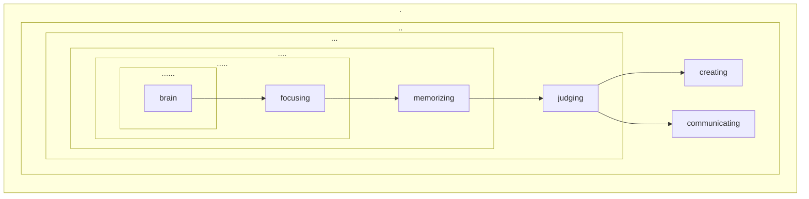

# 为什么？

## 要不要健脑？

两百多年前，人类经历了一场**工业革命**。在接下来的时间里直至今天，这场革命对人类的**体力**到底造成了什么样的影响呢？

突然之间，很多人不需要再像以前那样每天做在今天看起来绝对是超量的体力劳动了…… 结果呢？结果异常明显且又不可否认：绝大多数人的体力都变差了。几代人之后，绝大多数人若是有机会坐时光机穿梭回两百年前，干脆就是**非弱即残**，一定是那个时代里最令人看不起的所谓**手无缚鸡之力之辈**。

当然，这个事实长期很隐蔽，因为科技的发展，物资的丰富，医疗技术的进步，营养供给的充足，这一切都造就了另外一个结果，人们的平均寿命增加了，从十九世纪末差不多 30 岁不到，到了二十世纪初接近 80 岁…… 谁会觉得现代人的体力比古代人差很多有什么了不起的呢？

让我们看看光谱的两端，一方面是绝大多数人的**体力沉沦**…… 另外一方面呢？有另外一群人却与此同时通过**主动锻炼**获得了古代人绝对不可能拥有的体力。

作为现代人，我们中的绝大多数，能一口气做 10 个俯卧撑可能就属于至少前 20% 的人群了；古代人也许体力整体上比我们好，但，估计他们当中能一口气做 100 个俯卧撑的也并不是特别多…… 你能猜到现在世界纪录保持者能连续做多少个俯卧撑吗？1980 年，日本的吉田实（*Minoru Yoshida*）不停地做了 10,507 个俯卧撑。1993 年，美国的查尔斯·塞尔维齐奥（*Charles Servizio*）在 21 小时 21 分钟内做了 46,001 个俯卧撑…… 

不仅是**体力**的所谓**极限**在不停地被突破，更重要的是，虽然依然占总人口的比例极低，但，从绝对数量上来看，其实是越来越多的人练出了越来越强的体力。

1908 的奥运会马拉松纪录是 2 小时 55 分 18 秒。100 多年后的今天，新的纪录大约是 2 小时 2 分 57 秒，同样的距离少用了 50 多分钟，也就是说，时间缩短了 30%。100 年前，全球只有一个人能跑 2 小时 55 分 18 秒；哪怕是 3 小时 5 分钟，实际上也没几个…… 可现在呢？每年有资格参加波士顿马拉松赛的选手大约有 3 万名，他们中的每一个，都是因为能超过最低成绩，3 小时 5 分钟。

这就是那次惊天动地的**工业革命**在随后的时间里给人类的**体力**带来的影响：

> * 更大比例的人的体力变得越来越差（比如从 20% 增加到了 90%）
> * 自主锻炼的人群比例越来越低（比如，从 20% 降到了 10%）
> * 但，自主锻炼的群体中，更大比例的人获得了比过往更好的成绩（比如，从 20% 中的 20% 提高到了 10% 中的 80%）
> * 自主锻炼的群体中，最佳成绩在过去万万不能不可想象（比如，4.6 万个俯卧撑）
> * 第一和第二的距离在持续拉长，且足够令人震惊（比如，第二可能只能做到 2 万个俯卧撑）

以此为参照，再让我们想象一下人工智能的突然出现和迅猛发展会对人类的**脑力**产生什么样的影响呢？

正如工业革命之后生存必须对人类**体力**的要求越来越低一样，生存必需对人类**脑力**的要求其实也在持续降低。生物界统一的基本原则随时会在任何地方发挥作用：**用进废退** —— 显然，这个原则每时每刻都在改变人类的大脑。

这不是人工智能时代的特殊现象，这是已经持续了很多年的趋势。过去的三五十年里，商品社会高度发展的原因之一，就是被普遍应用的**傻瓜化设计原则** —— 采用这个原则设计商品或者服务，不需要消费者学习，不需要消费者思考，它们都是拿来就可以直接用的东西，所以才是真正有潜力大卖的商品或服务。

现在，这个早已出现并发挥作用的趋势正在被人工智能无限放大 —— 因为人工智能降低了**所有学习的难度**…… 也就是说，哪怕迫不得已需要学习，哪怕迫不得已需要思考，也因为人工智能的加持而变得容易，换言之，学习成本和思考成本因此极大降低。用进废退，必须用只能进，无需用则自然废。

于是，**人工智能出现与发展对人类脑力的普遍影响**，其实是与**工业革命对人类体力的普遍影响**要么平行要么一致：

> * 更大比例的人的脑力会变得越来越差
> * 自主锻炼的人群比例越来越低
> * 但，自主锻炼的群体中，会有更大比例的人能够获得了比过往更好的成绩
> * 自主锻炼的群体中，最佳成绩在过去万万不能不可想象
> * 第一和第二的距离在持续拉长，且足够令人震惊

其实，这样的趋势，在人工智能**突然出现**之前早就已经如此了。

2015 年，印度的拉吉维尔·米纳（*Rajveer Meena*）成为公认的纪录保持者，他背诵了 π 的前 7 万位数字，累计背诵时间长达 9 小时 7 分钟；而日本的原口彰（*Akira Haraguchi*）声称自己背诵了更令人难以置信的 10 万位数字，是 42 年前所有人背诵数字的近 200 倍。再比如，印度的维卡斯·夏尔马（*Vikas Sharma*）能在一分钟内就能计算出 12 个大数的根，每个数都有 20 到 51 个数字，根的范围从第 17 根到第 50 根不等，他的速度比许多人把数字打入计算器而后读出答案还要快。

**记得住 π 的前 7 万位数字**或者**快速心算某个 51 位的大数的第 50 根**是**超级脑力**的惊人例子，就好像**4.6 万个俯卧撑**一样，能够让我们看到**极限**不断被突破的实例。但，这样的例子多少对绝大多数**坚定地自认为是普通人**的读者或者听众感到淡漠，误以为跟自己毫无关系。

一旦养成习惯，**健身**只不过是生活里的一个必要组成部分。即便是那些并没有**健身习惯**的人也知道自己未能养成的这个习惯事实上非常重要，没有人会执拗地认为健身有害所以反对健身。同样的道理，一旦养成习惯，**健脑**也只不过是生活里的一个必要组成部分，并且相对于健身显然更为重要，无论有没有**健脑习惯**都不可能有人认为认为健脑有害因此需要坚决反对健脑。

**要不要健脑**和**要不要健身**一样，只能是个体的**主动选择**。号召大家健身的作用聊胜于无。只要到健身房里看看就知道了…… 早早养成健身习惯的人，哪怕没有健身房，哪怕不用交钱请教练，也一直在练，不练不行，谁都拦不住。而那些要在健身房里花钱请教练却又坚持不了多久的人，绝大多数都是那些发现自己的身体竟然已经坏掉了才不得不去健身的人。

区别在于，身体变差了或者坏掉了很容易发现，可脑子变差了甚至坏掉了呢？对此人们往往无法自知 —— 当然，现在也没有足够的医疗技术与设备可以用来随时提醒。于是，健脑的人早早就开始健脑，一直健脑，拦都拦不住，而不健脑的人弄不好到死都不会想到过自己竟然有健身的必要。

显然，我们有必要天天**健脑**，正如我们实际上有必要天天**健身**一样 —— 只不过人群中主动健身的占比非常低，且事实上越来越低。更为显然却竟然更多被忽视的是，**健身**比**健脑**更重要，哪怕不健身也要健脑，不是吗？当然，归根结底，这是你自己的选择，人生的一切，终归都是自己选的。

值得注意的是，早期建立的健身习惯，往往并不是孩子自身的选择，而是父母的主动选择，因为那时他们尚不具备完善的主动选择能力。**健身习惯越早建立越好**。越是早期，习惯养成越是容易，与此同时，越是早期养成的习惯越是难以撼动。同样的道理，**健脑习惯也是越早建立越好**，可它和健身习惯一样，不大可能是孩子自身的主动选择，只能靠父母的主动。在这一点上，很显然，为人父母，越早觉醒越好。

## 什么最健脑？

在过去的两百多年时间里，一方面是大多数人体力变得越来越差，另外一方面是那些主动健身的人成绩越来越好。人们投入了无数的时间与精力去研究如何提高成绩。

马拉松运动员为了跑得更快，改变了呼吸方式、改变了跑步姿势，甚至在不断研究如何改进运动鞋，使用更先进的材质把跑鞋改得越来越轻；与此同时，出于自我保护，关于跑鞋怎么做才能更好地减震，迄今为止也不知道更新多少次专利。

登山运动员也一样，除了各种训练方式的改进之外，所有的设备包括登山绳、登山锤、登山鞋和手套都在不断改良，为了减重，通过科研，把所有衣服的材质全都更换了不知道多少遍，保暖衣在越来越薄越来越轻的同时，不仅能更好地吸汗还能更好地透气。

在健身房里，人体的骨骼肌总计 600 多块，其中的每一块肌肉都有许多种专门的训练方法，并且往往有专门的设备可供使用，并且永远不止一种可供选择…… 并且，无论是方法还是设备，都在不断研究不断改进。

遗憾的是，在健脑方面，人类基本停留在百年甚至千年之前。人们不知道有哪些部位需要训练，甚至压根就没想到还有健脑的必要，当然也因此完全不存在什么针对性训练及其相关设备。

幸运的是，最佳的健脑项目过于显而易见 —— **锻炼自然语言使用能力**，无论哪一种语言。

**掌握并使用自然语言**，也许是所有人终生所能遇见的最复杂且有最系统的大脑工作任务。令人惊讶的是，与此同时，对大脑来说，掌握并使用自然语言，其实并不是生存必需…… 胃坏了牙坏了肯定不行，聋了哑了其实并无所谓，毕竟聋哑实际上并不影响一个人的寿命。

自然语言可以很简单。日常生活里，人们大约只需要 500～1000 的词汇量就足够完成日常必要沟通。当然，自然语言也可以无限复杂。现代汉语大词典收录单字字头 13,000 多个，各类词语 156,000 多条；而牛津英语词典收录了 301,000 个词条。

词汇量的增加，就好像是网络中的节点增加一样，会呈几何级数地增加网络复杂程度。只要 6 个 2x4 的乐高积木块，就可以有 915,103,765 种组合方式。想象一下那么多的词条总计可以有多少种组合方式。在牛津词典里，即便是在严格遵守**如非必要绝不添加**原则的情况下，总计有 577,000 个交互参考说明（*cross-references*）。

科学，主要使用的是**人工语言**。人工语言是自然语言的一个子集，由相对极少的词汇与一些作为补充的符号构成 —— 数学如此、物理如此，化学如此，计算机的编程语言也是如此。从自然语言中提取精简且又系统的人工语言，是人类的一大创举，也使得人类的智慧可以迅速积累极大提高。与此同时，主要由人工语言构成的知识，到最后还是得靠自然语言才能更大面积传播。

与之相对的，我们在学校里花最长时间学习的，也是语文课，从开始上学一直到学校毕业。不仅如此，到了近代，全球的教育体系都一样，都纳入了第二语言学习，同样贯穿整个在校教育过程 —— 虽然效果并不怎么样。

实际上，如果我们肯穿过表象看透实质的话，学校里的一切课程都是语文课 —— 本质上都是老师们在用**自然语言**讲授用**人工语言**记录并传播的**知识**。很多人数理化成绩不佳，底层原因其实是语文问题。科学知识本身没多复杂，但，语文基础不过关的结果是，课程听不懂，或者题目读不懂，理解不完整，甚至干脆理解错误，这才导致了最终浮现在表面的那些千奇百怪的问题。

顺带说，中国人学英语还是相对来看运气好的。英美国家的人也在学校里学外语，但他们比我们倒霉一点。我们学了英语之后，到哪儿都有用，尤其是在知识的海洋里遨游的时候 —— 这一点也没什么办法，因为目前人类的知识就是主要用英文记录并传播。英美国家的人呢？在学校学了一门西班牙语，除了考试之外哪儿哪儿都用不上，哪怕下了班去个西班牙餐厅，发现人家服务员说的还是英语。（这不是我开的玩笑，而是一位美国大学教授的慨叹和抱怨（*The Case against Education*）。

个体之间的自然语言使用能力，可以是 0 或某个数值与天文数字之间某个数值的差异。从这个角度望过去，每个人无论当前的自然语言使用能力如何，都有无限的提升空间 —— 用它健脑和健身非常不一样。

你跑马拉松，无论如何也不可能只用 3 分钟跑完；你登山，地球上也没有海拔 10,000 米以上的山峰可以让你爬，你去健身，无论怎么练也不可能把自己练成 200 公斤以上 —— 据说目前地球上最重的健身运动员体重是 400 磅，身高 193 厘米，每天要摄入 12,000 卡路里才行，那也只不过是 181.44 公斤。

可自然语言使用能力不一样，无限空间无限可能。你可以把它练得更好，使自己的日常沟通更为有效，或者让自己通过公开讲演获得更多的影响力；你也可以用它写书，小说或者非小说；你还可以用它写剧本，电视、电影、短剧…… 你还可以学习并使用多种语言，每一种语言都有同样无限的可能性…… 没有尽头。

自然语言使用之于脑力正如马拉松之于体力。如果，跑步是最为普适的**健身运动**，那么，自然语言使用就是最有趣且最为普适且的**健脑运动**。

显然，跑步相对于自然语言使用来看更为枯燥。事实上，一切体育运动相对于自然语言使用来看都显得枯燥许多，因为自然语言是更大的更复杂的网络，由更多的节点构成。用得不好就算了，用得好的话，有趣的地方实在是太多。

**跑步**锻炼最多使用最多锻炼的是对体力运动来说最重要的器官，**心**与**肺**。而**自然语言使用**对应的是大脑里的白质与灰质。语言能力更强的人以及多语使用者，从大脑结构上来看，他们都比其他人拥有相对覆盖面积更大的**白质**和密度更高体积更大的**灰质** —— 这不是天生的，这只能是后天训练的结果。

关键在于，白质和灰质不止用来处理语言…… 事实上，人类无论做什么都用它们靠它们。白质的主要功能之一是协调大脑的各个部分，它的**覆盖面积**越大，大脑各部分之间的协同效率就越高。**灰质**是中枢神经系统对信息进行深入处理的部位，它的**密度**越高**体积**越大，人就越聪明，因为那里已经存储、相互关联、可以处理的信息就越多。

脑科学家们对各类专家的大脑进行扫描的结果发现，虽然大家术业有专攻，但到最后，这些人的大脑都具备相同的表征 —— 都是白质覆盖面积相对更大，灰质密度相对更高、灰质体积也相对更大。与此同时，白质覆盖面积相对更大、灰质密度相对更高、灰质体积相对更大的人，无论学什么都更快，无论做什么都更好。不仅如此，这样的人还更擅长处理多任务，所以做事的时候总是效率更高。总而言之，他们的**大脑可塑性**总是相对更强。

并且，随着年龄增加，白质覆盖面积相对更大、灰质密度相对更、高体积相对更大的人，抗衰老能力更强。所谓的**耳聪目明**，实际上并不是耳膜或者眼角膜所决定的，真正决定视力和听力的其实是大脑。如果大脑出了问题，即便耳膜眼角膜都正常，视力和听力也都会出问题。所以，更大覆盖面积的白质，密度更高体积更大的灰质，自然会延缓大脑衰老，也能预防很多老年疾病，比如帕金森症综合症。对普通人都适用的是，更好的大脑机能显然会更少罹患抑郁症。

